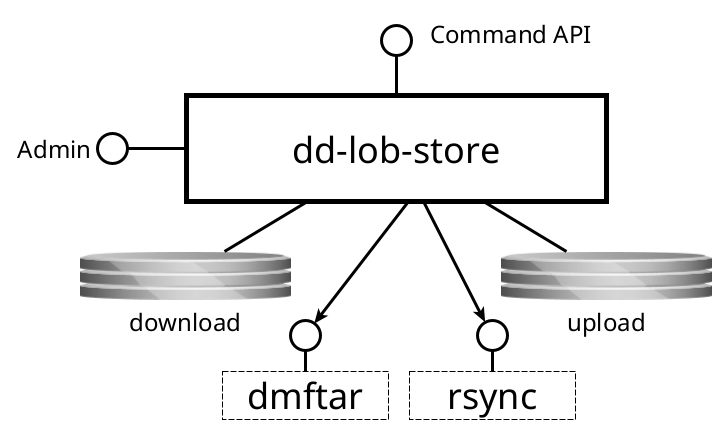

dd-lob-store
=============

Manages DANS Data Vault Large Object Stores

Purpose
-------
Transfers large files from Dataverse instances to a Data Vault Large Object Store.

Interfaces
----------

This service has the following interfaces:

{width="70%"}

#### Command API

* _Protocol type_: HTTP
* _Internal or external_: **internal**
* _Purpose_: to manage the service including starting transfers

#### Admin console

* _Protocol type_: HTTP
* _Internal or external_: **internal**
* _Purpose_: application monitoring and management

### Consumed interfaces

#### DMFTAR

* _Protocol type_: Local command invocation
* _Internal or external_: **external**
* _Purpose_: to create DMFTAR archives for buckets.

#### rsync

* _Protocol type_: Local command invocation
* _Internal or external_: **external**
* _Purpose_: to transfer files from the local upload directory to [SURF Data Archive]{:target=_blank}

[SURF Data Archive]:  {{ surf_data_archive }}

Processing
----------

### Disk quotas

Before discussing the processing pipeline, it is important to understand how the service manages its limited working disk space. Both the download and upload
folders are assigned a quota, managed by a disk quota manager. The idea is that a task must first claim sufficient disk space to perform its work. If that space
is not available, the task is not scheduled. The steps below, starting from [Inspect](#inspect), all use a polling mechanism, which checks the source table for
new work. Before scheduling a task, the service checks if the necessary disk space can be claimed. If not, the task is not scheduled and will be retried in the
next polling cycle.

### Request

The service receives requests for transfer via the API. It checks whether the SHA-1 checksum is already present in the targeted LOB-store. If so, the
file download request is immediately changed to `DONE`. It also checks whether a file download request for the same SHA-1 is already present with a status other
than `FAILED`, `REJECTED` or `DONE`. If so, the file download request is not created and a 409 Conflict status is returned to the caller.

Otherwise, the file download request is created as `PENDING` in the database.

### Inspect

The Inspect step retrieves the file metadata from the Dataverse instance, including the size and the SHA1-checksum. The size is stored in the
fileDownloadRequest record.
If the SHA-1 checksum from Dataverse does not match the one from the request, the fileDownloadRequest is set to `REJECTED`. If the checksum is OK, the
fileDownloadRequest is set to
`INSPECTED`.

### Download

The File Download step is responsible for downloading a file. Before the task is scheduled, two disk quotas are claimed in the download folder:

1. One for the size of the file;
2. One for the size of the file plus a margin.

The task downloads chunks of a configurable size and concatenates them at the end. The second claim is necessary for the concatenation step. The task then
computes the SHA-1 and verifies it. If it does not match the fileDownloadRequest is set to `REJECTED`. If the checksum is OK, the fileDownloadRequest status is
set to `DOWNLOADED`. The
second of the aforementioned claims is then released.

### Package

The Package step is responsible for packaging one or more files into an archive file, typically using DMFTAR. It looks for `DOWNLOADED` files from older to
newer adding files until the total size exceeds the minimal package threshold. It then claims two quotas in the upload folder:

1. One for the combined sizes of the selected files;
2. One for the combined sizes of the selected files plus a margin.

It then creates a bucket folder in the upload folder and moves the files into it. For each file the remaining claims on the download folder are now released.

The task now runs the configured packaging command. If that succeeds, the source files are deleted and the second claim on the upload folder is released.
Finally, the status of all the corresponding fileDownloadRequests is set to `PACKAGED`.

### Upload

TO DO

### Verify

Finally, on finishing the transfer, the archive package is verified using the configured verification command. 